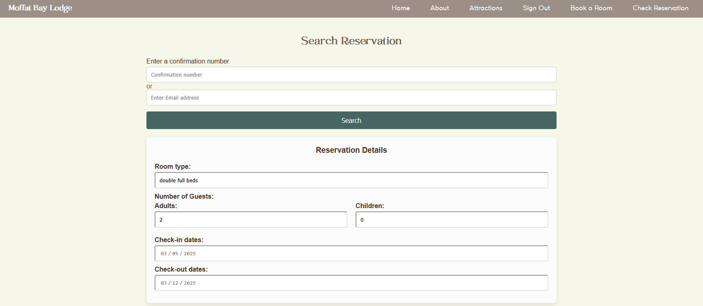

# CSD460-Capstone

A hotel reservation website where guests can login, register for free accounts, and book stays. 

## Collaborators:
* Jacob Ambrose
* Jackie Scott
* Marissa Lee
* Professor Sue Sampson

## Home Page

## About Page

## Attractions Page
* Base attractions Page

* Attractions Page reflecting on hover effect of icons

## Login Page
*Login Page and navbar will update on successful sign in

*Updated navbar reflecting Sign Out after successful login

* On successful logout:

## Registration Page
* Registration Page

* Registration Page Error for password requirements not being met:

* Registration Page reflecting successful Registration:

## Booking Page
*conditional login will redirect to login if user is not currently logged in

* Will check that check out is after check in dates

* On Success will redirect to Checkout Summary Page

* After submit reservation user is provided confirmation number 

## Check Reservation Page

* Error thrown if user has not entered either a confirmation number or an email address

![]

* On Success will display the most recent guest reservation for that email or confirmation ID

